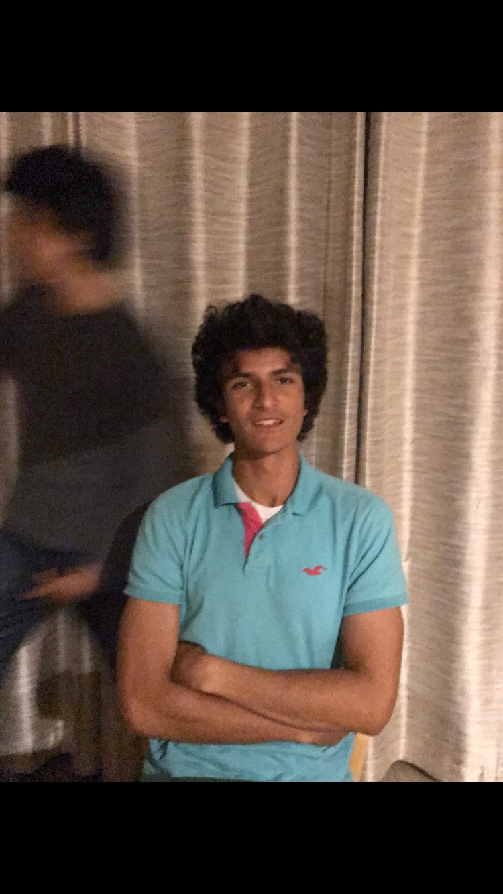

# practice-shayan-r
My name is Shayan Raisi, I am from Yuba City. In SPIS I hope to gain an understanding of the general principles of computer science. I play the guitar and piano, and I also play most sports, so anything would be fine for the non-academic sessions. 

